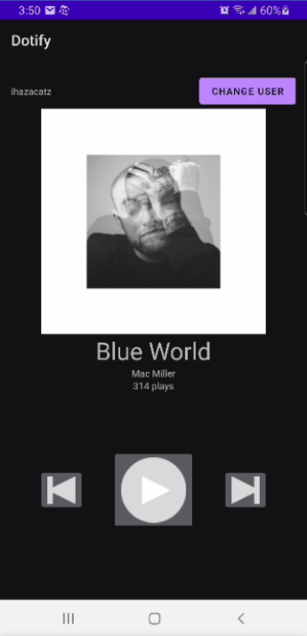
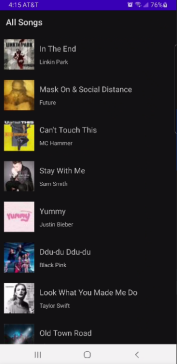
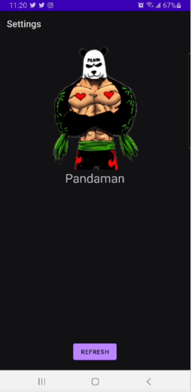

# Dotify (hw4) by Vincent Ma

This is a music app that displays a library of music. Each song is clickable, and can bring you to a
music player with some extra settings.

## Extra credit
No extra credit attempts this time. :(

## Screenshots

## Additional Info
To open the mini-player, the onclick only reacts when either a TextView or ImageView is clicked.
Pressing the refresh button on the profile page calls the HTTP GET request.